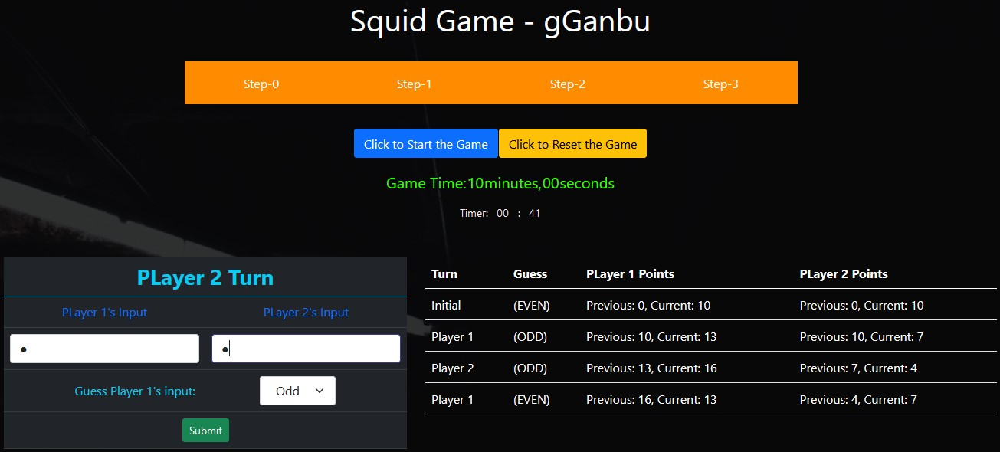

## gGanbu
Gganbu means "old and close friend". It also means "partner".

### Features
 - [x] IIFE
 - [x] Timer
 - [x] Even / Odd
 - [x] Input Validation (Number only 0 - 9 will be acceptable)
 - [x] Event Delegation

 ### Rules
 1. Game will start, when clicking the 'Start' Button
 2. Game will be abandoned & reset, when Clicking the 'Reset' Button
 3. Game's timer can't be paused or changed before reaching to 10:00
 4. Steps-0 to Steps-3 are the condtions to run the Game
 5. A player can't give more than his current point
 5. By changing turns, the game will continue
 6. If any player can't achieve 20 points before the timer reach to 10:00, then the game will be counted as 'DRAW'